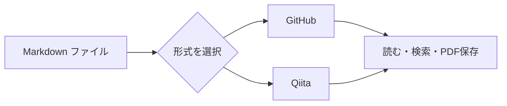

# ひとつの文書を、ふたつの記法で。

**MDV** は GitHub と Qiita の記法を切り替えて読める、Windows 用 Markdown ビューアです。

右上の **GitHub / Qiita** を切り替えると、このサンプルの表示が変わります。ファイルをドロップするか、<kbd>Ctrl</kbd> + <kbd>O</kbd> で手元の文書を開いてください。


## 共通の記法

表、リスト、**太字**、*斜体*、~~取り消し線~~、`インラインコード`、絵文字 :sparkles: を表示します。

| 機能 | ショートカット |
| :--- | :--- |
| ファイルを開く | Ctrl + O |
| 文書内を検索 | Ctrl + F |
| GitHub / Qiita 切り替え | Ctrl + 1 / Ctrl + 2 |
| ソースを表示 | Ctrl + U |
| 再読み込み / 印刷 | F5 / Ctrl + P |

- [x] ファイルを開いて読む
- [x] 目次から見出しに移動する
- [ ] 自分の Markdown を表示してみる

### 改行の違い

この行と次の行の間には、通常の改行があります。
Qiita では改行し、GitHub では同じ段落につなげます。

## GitHub のアラート

> [!NOTE]
> GitHub モードでは、この引用を補足枠として表示します。

> [!TIP]
> 外部エディターでファイルを保存すると、表示も自動で更新されます。

## Qiita の補足枠

:::note info
Qiita モードでは、緑の補足枠になります。**太字**やリストも使用できます。
:::

:::note warn
両サービスと完全に同じ表示を保証するものではありません。詳細は画面下の「対応範囲」で確認できます。
:::

### ファイル名と差分

Qiita モードでは、コードの上にファイル名を表示します。

```javascript:hello.js
const message = 'Hello, Markdown!';
console.log(message);
```

```diff_python:example.py
-print("before")
+print("after")
```

## 数式

インラインの数式 $`E = mc^2`$ と、ブロックの数式を表示できます。

```math
\sum_{k=1}^{n} k = \frac{n(n+1)}{2}
```

## Mermaid の図



## 折りたたみと脚注

<details><summary>クリックして詳細を表示</summary>

この中にも **Markdown** を書けます。HTML タグの後に空行を入れてください。

1. ファイルを開く
2. 形式を選ぶ
3. 読む

</details>

脚注への参照も利用できます。[^note]

[^note]: 本文は外部の変換 API に送信せず、このアプリ内で処理します。描画ライブラリも同梱されています。

## リンク

[別のローカル文書を開く](another.md#日本語の見出し) / [先頭の共通記法へ](#共通の記法)

Qiita モードでは、単独の URL をリンクカードの枠として表示します。

https://qiita.com/Qiita/items/c686397e4a0f4f11683d
